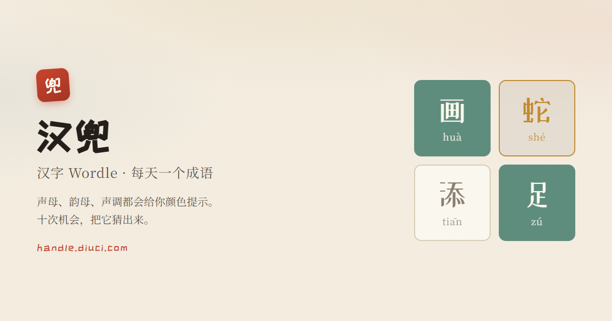

# 汉兜 · 丢词夺理复刻站



**线上地址：[handle.diuci.com](https://handle.diuci.com/)**

汉字版 [Wordle](https://www.powerlanguage.co.uk/wordle/)：每天一个成语，用声母、韵母、声调的颜色提示，十次机会猜出来。

本站是 [丢词夺理](https://diuci.com/) 的**非官方复刻**，玩法与词库来自开源项目
[汉兜 Handle](https://github.com/antfu/handle)（© Anthony Fu，MIT）。
许可与署名见 **[NOTICE](./NOTICE)**，上游许可原文见 [LICENSE](./LICENSE)（未作修改）。

请勿剧透。

> **注意**
> 汉兜的答案库至 2023 年 2 月 28 日为止不再更新；之后的题目从过往一年的题目中随机抽取（`seedrandom('day-N')`）。
> 这条机制沿自上游，本站未改，也**不需要**为上线新题。

## 开发

```bash
npm install
npm run dev      # http://localhost:4444
npm run build    # 产物在 dist/
npm run test     # vitest --run
```

需要 Node.js >= 20。包管理用 npm（不是 pnpm）。

加 `?dev=hey` 可以翻看任意一天的题目，用于自测。

## 成语勘误

成语数据库储存于：

- [./src/data/idioms.txt](./src/data/idioms.txt) — 已知的成语列表
- [./src/data/polyphones.json](./src/data/polyphones.json) — 特殊发音的成语列表

二者互不包含。

如遇成语缺失或发音错误，编辑 [./src/data/new.txt](./src/data/new.txt)，一行一词，然后执行 `npm run update`，
脚本会自动抓取[汉典](https://www.zdic.net/)的数据更新数据库。汉典也缺失的成语会留在 `new.txt` 里，需要人工判断。

## 技术栈

- [Vue 3](https://v3.vuejs.org/) + [Vite](https://vitejs.dev/)
- [UnoCSS](https://unocss.dev/)（`presetWind3`，dark 走 class）
- [VueUse](https://vueuse.org/)
- 骨架沿自 [Vitesse Lite](https://github.com/antfu/vitesse-lite)
- 视觉语言与 [diuci.com](https://diuci.com/) / [k12.diuci.com](https://k12.diuci.com/) 共用一套

## 许可

- 上游代码：[MIT](./LICENSE) © 2021-PRESENT [Anthony Fu](https://github.com/antfu)
- 本站的改动与站点内容：同样按 MIT 分发，署名与来源见 [NOTICE](./NOTICE)
